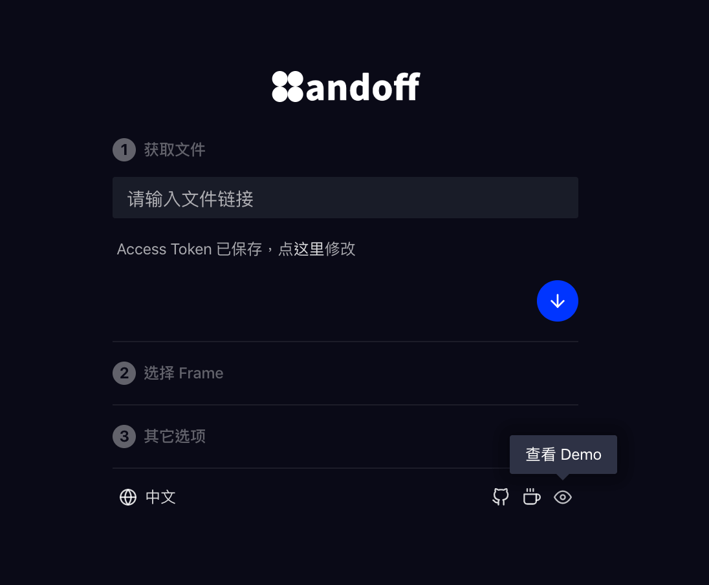
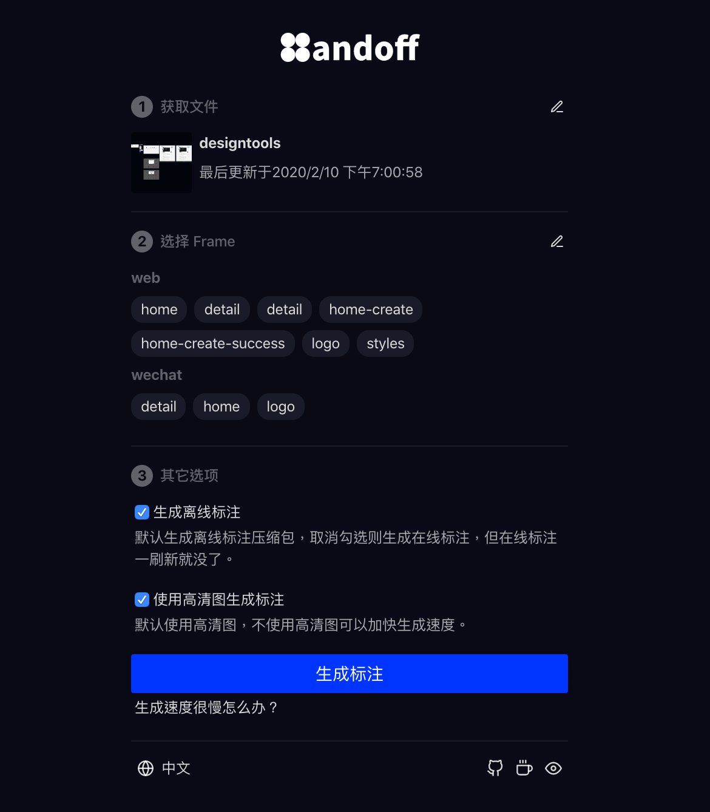
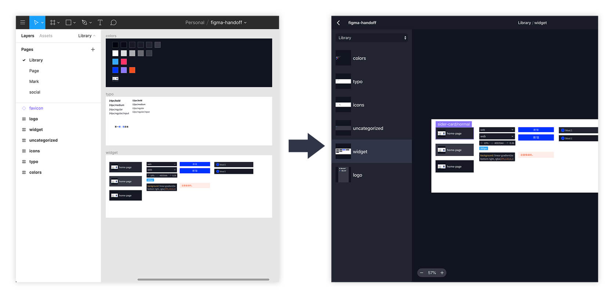
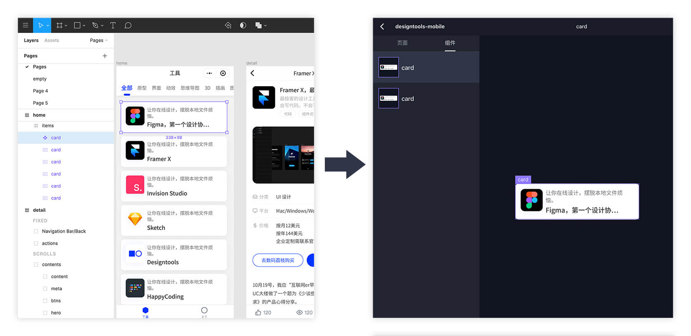

>这个项目使用了 [Create React App](https://github.com/facebook/create-react-app) 脚手架。

**现在可以使用插件啦！点击[这里](https://www.figma.com/community/plugin/830051293378016221/Juuust-Handoff)安装。**

**推荐查看[从设计到交付到开发，Juuust Handoff 食用说明](https://mp.weixin.qq.com/s/H01fw3bzR8BxcuV74TWPtw)。**

[English Version](./README.md)

## 简介

Figma Handoff 是一个设计交付工具，可以帮助你从 Figma 设计文件生成标注，方便开发人员查看。它是一个线上应用，通过 [Figma API](https://www.figma.com/developers/api) 获取设计数据，并生成离线或在线标注，但不会将你的数据保存至任何服务器。

访问地址：https://figmacn.com/handoff/

你可以通过这个按钮查看 Demo。

## 使用说明

通过上面的链接进入之后，你需要输入要生成标注的文件地址，以及 [Access Token](https://www.figma.com/developers/api#access-tokens)，来获取你页面中的 Frame。**为了方便，你的 Access Token 会被保存在本地浏览器上，所以为了安全请不要在不信任的电脑上使用（比如网吧、或者你表弟的电脑）。**

接着选择你需要生成标注的 Frame，到下一步选择图片质量和是否生成离线标注，就可以生成标注啦。**需要注意的是，Figma Handoff 只会抓取到你在画布中的第一级的 Frame，所以请不要使用 Group 将第一级的 Frame 圈在一起。**

## 常见问题
### 生成标注很慢怎么办？
生成速度取决于文件大小和网络情况，如果太慢可以考虑：
- 在第二步选择部分 Frame，而不是所有。
- 在第三步取消勾选使用高清图。
- 由于是直接访问 Figma 的数据，可以将你的梯子开启全局以加快速度。

### 什么是 Access Token？
简单来说 Access Token 就是一个访问令牌，拿着它才可以获取到你的 Figma 设计文件数据。你可以在个人设置页面生成，生成后需要立即复制出去，不然一刷新就没了。**由于拥有了 Access Token 就可以获得你所有的设计文件数据，所以请不要把它粘贴在容易暴露的地方（比如抄在手上，写在便利贴上）。**

### 我的数据会被偷偷存起来吗？
不会。Figma Handoff 通过你的 Access Token 来获取设计文件数据，所有的标注工作均在本地浏览器上完成。不过由于图片的跨域问题，生成标注所需要的图片（如 Frame 缩略图、组件缩略图和切图）要经过一个服务端程序处理一下，这个程序的代码也[开源](https://github.com/leadream/cors-anywhere)了，运行于 [Heroku](https://heroku.com/) 上。

### “导出组件列表”是什么意思？
如果你勾选了此选项，Figma Handoff 会自动查找到该文件中所有的 Master 组件，并在左侧生成一个组件列表。这样的话会额外获取组件图片，从而导致生成标注时间变长，因此推荐你将所有 Master 组件统一放在一个 Page 中，而不要放在设计图中，这样就不需要额外导出组件列表了。

**✅ Master 组件单独放在一个 Page 中**

**❌ Master 组件混在设计中**

### 切图要怎么交付？
我推荐切图由设计师完成。你只需要在 Figma 中右侧属性面板最下面的 Export 中添加切图设置，Figma Handoff 会自动识别文件中的所有带有 Export 的元素来生成切图。比如下图（这个元素名是 `thumb-up`）会生成两个切图，`thumb-up-ios@3x.png` 和 `thumb-up.svg`。

### 还有啥要注意的吗？
- 画布中第一级 Frame 尽量都勾选 `Clip Content`，否则会引起标注错位。

- 除了常用的缩放移动画布，你还可以通过左下角的按钮，键盘加减号来缩放，按住空格键还可以拖拽画布。

## 赞赏
这个工具目前免费且开源，如果对你有帮助的话可以赞赏支持我一下，谢谢。

PayPal: https://paypal.me/leadream

