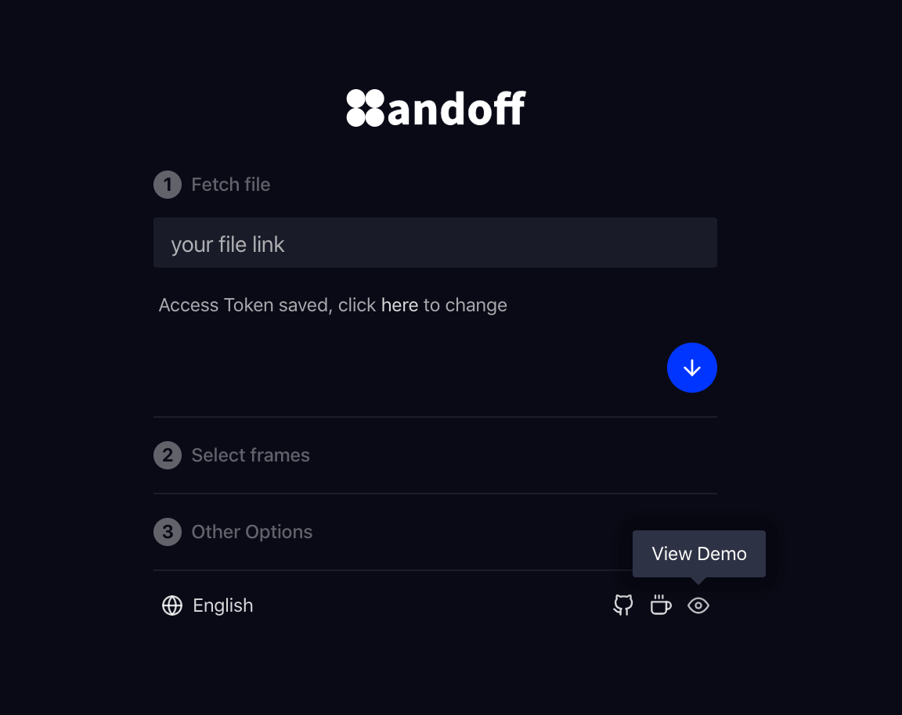
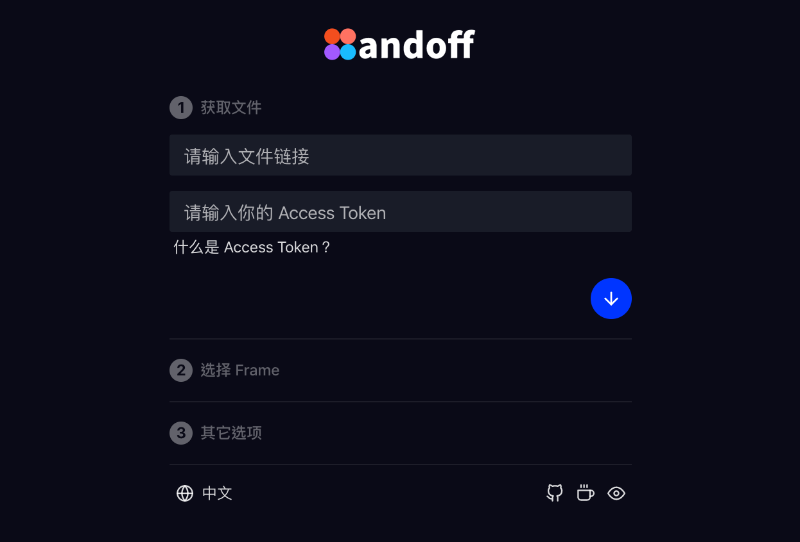

>This project is using [Create React App](https://github.com/facebook/create-react-app).

**Plugin is available now! Click [here](https://www.figma.com/community/plugin/830051293378016221/Juuust-Handoff) to install.**

[中文说明](./README-CN.md)

## Introduction

Figma Handoff is a design handoff tool that can help you generate design mark. It's useful for developers. Figma Handoff is a web app and uses [Figma API](https://www.figma.com/developers/api) to get your design data, but never saves you data in any server. 

Figma Handoff supports both offline and online mode. Please visit https://figmacn.com/handoff/.

Click here to see a demo.

## Usage

Visit https://figmacn.com/handoff/ and fulfill your file link and [Access Token](https://www.figma.com/developers/api#access-tokens), then you'll get your frames in the file. **It will save your Access Token in the computer for convenience so DON'T use it in the device that are not trusted (like Net-bar).**

Select the frames you need and other options, click the button to start generate. **It only fetch frames directly in canvas so DON'T group them or they can't be recognized.**

## FAQ
### Why it's too slow?
It depends on your network and file size. To speed up you can:
- Select less frames in the second step.
- Uncheck `use high quality images` option.
- Use VPN and use global mode.

### What is Access Token？
Simply say Access Token is a key to get your design data. You can generate an Access Token in the Figma setting page. **DON'T paste Access Token in somewhere that is not safe (like the computer note).**

### Is my design data saved saved furtively?
No. All the work will be done inthe browser after it fetches your data from Figma server. The images (Frame thumbnails, components thumbnails) will be processed in a server at [Heroku](https://heroku.com/) and the code is open sourced [here](https://github.com/leadream/cors-anywhere).

### What does "export components list" mean?
Figma Handoff will find out all the master components in this file and list them in left pannel if you check this option. This will make mark exporting longer because it'll fetch all components' images. We recommend you to place all master components in an independent page so you don't need to export components list.

**✅ master components in a page**

**❌ master components in your design**

### How to delivery sliced images?
I recommend designers slice images. All the elements with exports in the right panel will be ecported as sliced images. For example, the settings below will export `thumb-up-ios@3x.png` and `thumb-up.svg` (this element named `thumb-up`).

### Other advice?
- Check `Clip Content` for frames directly in the canvas or it'll cause offset issue.

- You can use `+/-` to zoom in or out, alse click spacebar to drag canvas.

## Buy me a coffee
Figma Handoff it's free and open sourced. You can donate me if you think it's useful. Thanks!

PayPal: https://paypal.me/leadream

