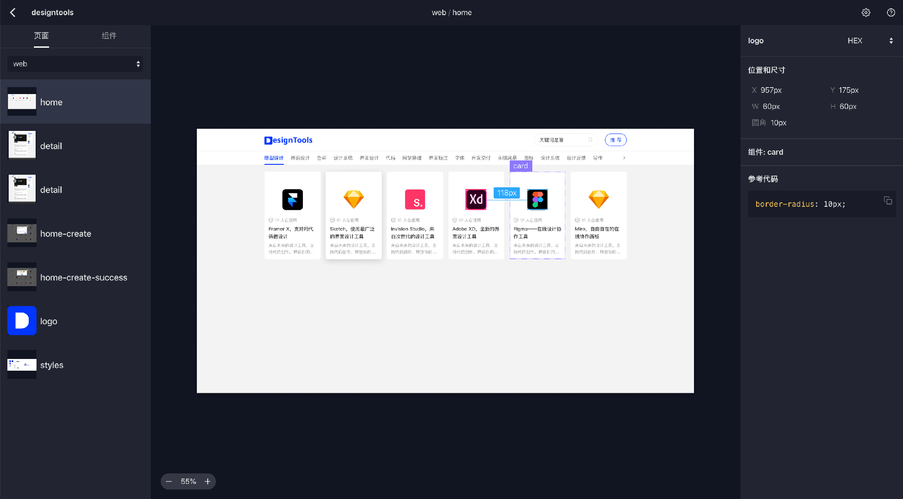
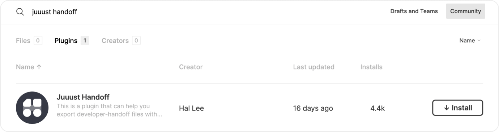
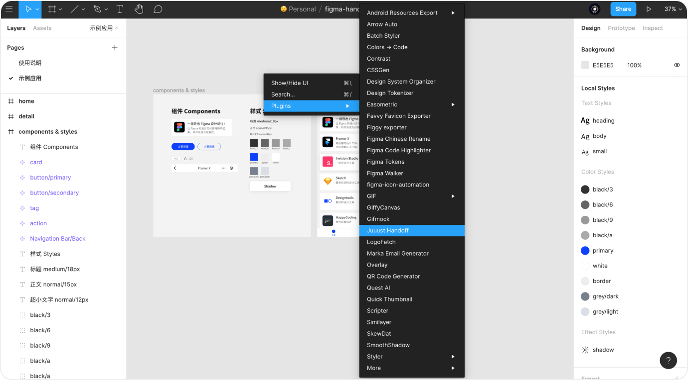
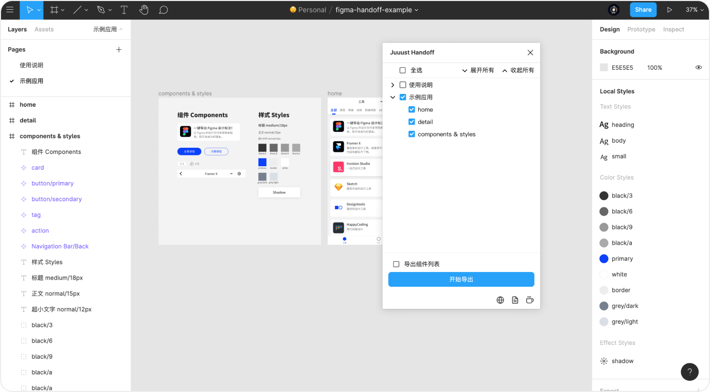
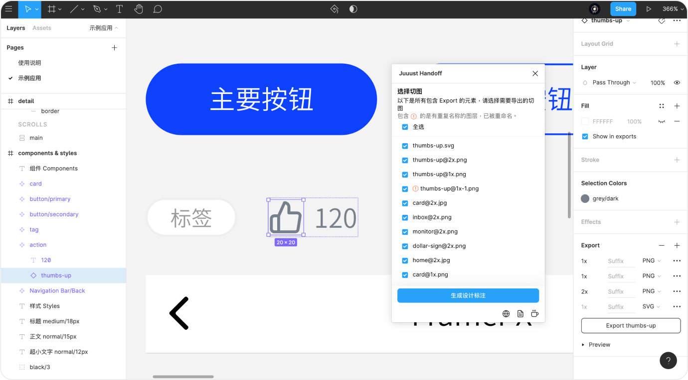
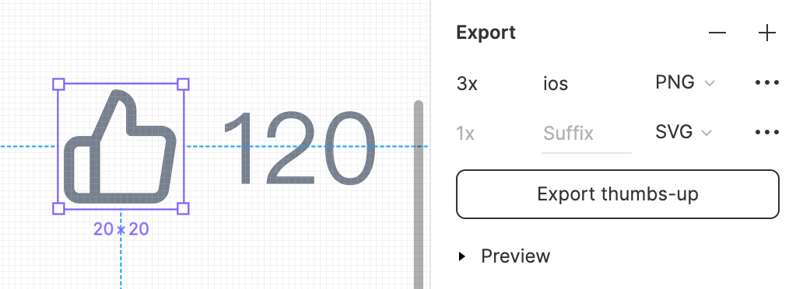
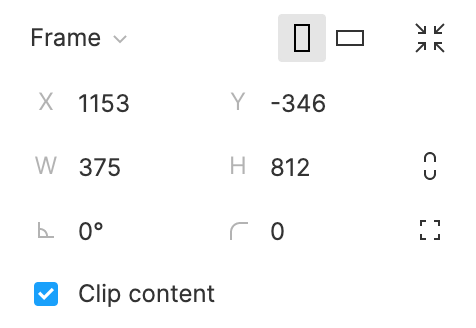

# Figma Heron Handoff

[中文说明](./README-CN.md)

[Heron Handoff](https://heron.design) can help you export developer-handoff files with design specs. This project is the template you generate from, to generate handoff file You need to install [Heron Handoff Plugin](https://www.figma.com/community/plugin/830051293378016221/Heron-Handoff) first.

- Demo: https://leadream.github.io/heron-handoff?demo=true
- Plugin code: https://github.com/leadream/heron-handoff-figma-plugin



## Usage

### 1. Install plugin
Visit [Heron Handoff Plugin](https://www.figma.com/community/plugin/830051293378016221/Heron-Handoff) in Figma and click install.



### 2. Run plugin in a file
Open a file in Figma, right click and select plugin -> Heron Handoff to run it.



### 3. Select and export
This plugin will recognize every top-level frame in the canvas and now you can select what you want.

Checking `Export components list` option will generate a list of components in the left panel of design specs. You don't need to check it if you just put all components in a page like below.



### 4. Select exports
The plugin will recognize all layers with export property. You need to select the images you want to export. The repeated images will be renamed and mark as a red symbol.

Just hit the generating button when everything is done.



### 5. View design specs
You will get a zip file after seconds. Upzip it and open index.html. Now you can view design specs. Send this zip to developers to handoff.


## As a module
It's published to [NPM](https://www.npmjs.com/package/heron-handoff) so you can install it as a react module if you want to develop based on it.

First at first, install it.

```bash
yarn add heron-handoff
```

Then import and configure it.

```jsx
import Canvas from 'heron-handoff'

const settings = {
  convention: 1,
  exportWebP: false,
  includeComponents: false,
  language: "zh",
  platform: 1,
  remBase: 16,
  resolution: 0,
  unit: 2
}
const pagedFrames = {
  "755:1494": {
    "name": "Plugin",
    "frames": [
      {
        "id": "2590:442",
        "name": "settings",
        "image": {
          "url": "/mock/2590-442.png"
        }
      }
    ]
  },
  "755:1493": {
    "name": "Dashboard",
    "frames": [
      {
        "id": "2941:26",
        "name": "file detail",
        "image": {
          "url": "/mock/2941-26.png"
        }
      }
    ]
  }
}
const exportSettings = [{
  contentsOnly: true,
  fileName: "icon@2x.png",
  format: "PNG",
  id: "I2590:136;2731:1",
  image: {url: "/mock/exports/icon@2x.png"},
  name: "icon",
  suffix: ""
}]
const fileData = {
  name: 'Handoff design',
  document: {},
  styles: {}
}

export default function () {
  return (
    <Canvas
      pagedFrames={pagedFrames}
      fileData={fileData}
      exportSettings={exportSettings}
      settings={settings}
      onHeaderBack={() => { console.log('Back icon clicked.') }}
    />
  )
}
```

The props is exported from [heron-handoff-plugin](https://github.com/leadream/heron-handoff-figma-plugin).

## FAQ

### How to deliver sliced images?
All the elements with exports in the right panel will be exported as sliced images. Note that slice layers without export property will not be exported, and also instance will not inherit export form main component.

For example, this settings below will export `thumb-up-ios@3x.png` and `thumb-up.svg` (this element named `thumb-up`).



### Why there are offsets in design specs?

There are two reasons for offset:
1. Some layers are flipped or transformed.
2. Layers overflow from top-level frame but `clip content` not checked.

I'm look into the first situation but you can check `clip content` for the second situation.



## Buy me a coffee
Figma Handoff it's free and open sourced. You can donate me if you think it's useful. Thanks!

PayPal: https://paypal.me/leadream


>This project is using [Create React App](https://github.com/facebook/create-react-app).
